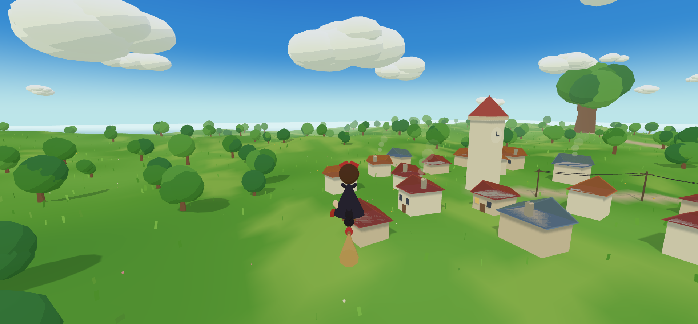

# 빗자루 소녀 — 지브리풍 하늘 산책 🧹✦

마녀 배달부 키키처럼 빗자루를 타고, 토토로·포뇨 같은 지브리 감성의 세계를
자유롭게 날아다니는 브라우저 3D 탐험 게임. 목표도 미션도 없이 —
그냥 날아다니는 것 자체가 기분 좋은 힐링 경험.



## 플레이

로컬에서 정적 서버로 열면 바로 실행된다 (빌드 없음):

```bash
python -m http.server 8000
# → http://localhost:8000
```

| 키 | 동작 |
|---|---|
| `W` / `↑` | 위로 올라가기 |
| `S` / `↓` | 아래로 내려가기 |
| `A·D` / `←·→` | 방향 바꾸기 (기체가 기울어짐) |
| `Shift` | 슝— 부스트 |
| 드래그 | 마우스·터치로도 조종 (두 번째 손가락 = 부스트) |
| `M` | 바람 소리 끄기/켜기 |
| `N` | 꾹 누르면 시간이 빨리 흐름 |

속도에 따라 거세지는 바람 소리가 함께 흐른다 (오디오 파일 없이 노이즈 합성).
하루 5분 — 낮, 노을, 별이 뜨는 밤, 새벽이 흐른다. 밤에는 마을에 불이 켜지고
등대 불빛이 바다를 쓸고 풀밭엔 반딧불이가 난다. 대왕나무 아래엔 누군가 살고 있다.

## 월드

사방이 바다인 커다란 섬. 어느 방향으로 날아도 지평선은 바다와 하늘로 이어진다.

- 시계탑이 있는 언덕 위 마을, 전봇대와 처진 전깃줄, 굴뚝 연기
- 논밭과 원두막, 버스 정류장 (토토로)
- 대왕 녹나무 언덕, 단풍 숲, 동쪽 바다와 등대 (포뇨)
- 무지개가 걸린 호수와 호숫가 벚꽃 숲, 바다로 흘러가는 강
- 알록달록한 들꽃이 가득한 꽃밭 언덕, 천천히 돌아가는 풍차
- 하늘을 떠도는 줄무늬 열기구, 원을 그리며 나는 새떼
- 앞바다의 작은 섬들 — 끝까지 날아가 보자
- 통과해서 날 수 있는 뭉게구름 — 들어가면 화면이 뽀얘진다

## 만든 방법

Three.js + 바닐라 JS 모듈 (CDN import map, 빌드 도구 없음).
외부 3D 모델·텍스처 없이 전부 프리미티브 조합과 코드 생성.
지브리 룩의 핵심 기법 — 밝은 그림자의 3단계 툰 셰이딩, 수평선색과 일치시킨 안개,
따뜻한 햇살 + 푸른 환경광, 버텍스 셰이더 바람 — 은 [DESIGN.md](DESIGN.md) 기획서 참고.
